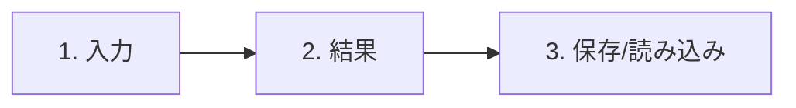
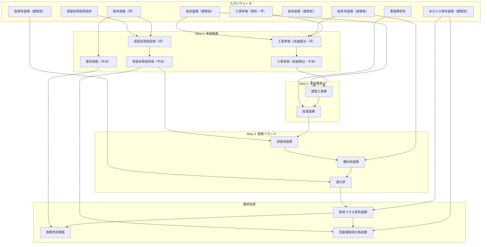
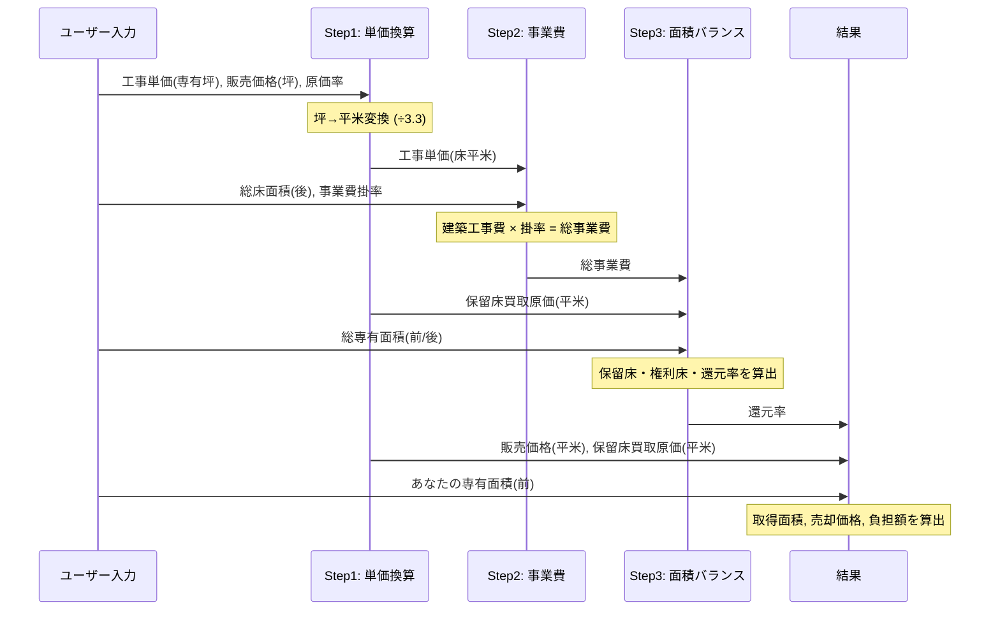

# マンション建替シミュレーション - 仕様書

## 1. 概要

マンション建替事業における区分所有者の還元面積・負担額を試算するWebアプリケーション。
建替前後の面積条件とコスト条件を入力することで、還元率（権利変換比率）や取得可能な専有面積、必要な負担額を即座に算出する。

| 項目 | 内容 |
|------|------|
| アプリ名 | マンション建替シミュレーション |
| フレームワーク | Streamlit (Python) |
| デプロイ先 | Streamlit Community Cloud |
| リポジトリ | `LeoNagumo/refund-simulator` |
| エントリポイント | `app.py` |

## 2. 技術スタック

| 技術 | バージョン | 用途 |
|------|-----------|------|
| Python | 3.11+ | ランタイム |
| Streamlit | >= 1.47.0 | WebUIフレームワーク |
| JSON | 標準ライブラリ | 結果の保存・読み込み |

## 3. ファイル構成

```
refund-simulator/
├── app.py                  # メインアプリケーション（全ロジック）
├── requirements.txt        # Python依存パッケージ
├── .streamlit/
│   └── config.toml         # Streamlit設定（セッションTTL等）
├── results/                # シミュレーション結果の保存先
│   └── <フォルダ名>/
│       └── *.json
├── specification.md        # 本ドキュメント
└── README.md
```

## 4. 画面構成

アプリは3つのタブで構成される。



### 4.1 タブ1: 入力

フォーム形式で9つのパラメータを入力し、「計算する」ボタンで計算を実行する。

| # | パラメータ | 変数名 | デフォルト値 | 単位 | 表示形式 | 制約 |
|---|----------|--------|-------------|------|---------|------|
| 1 | 建替前の専有面積 | `your_private_area_before_sqm` | 77.0 | 平米 | 小数1桁 | >= 0 |
| 2 | 工事単価（専有・坪） | `construction_cost_per_private_area_tsubo` | 2,500,000 | 円/坪 | 整数 | >= 0 |
| 3 | 販売価格（坪） | `sales_price_tsubo` | 7,500,000 | 円/坪 | 整数 | >= 0 |
| 4 | 事業費掛率 | `other_expenses_rate` | 1.25 | 倍 | 小数2桁 | >= 0 |
| 5 | 保留床買取原価率（%） | `reserved_floor_purchase_price_rate_pct` | 70 | % | 整数 | 0〜100 |
| 6 | 総床面積（建替前） | `total_floor_area_before_sqm` | 2,398 | 平米 | 整数 | >= 0 |
| 7 | 総専有面積（建替前） | `total_private_area_before_sqm` | 1,893 | 平米 | 整数 | >= 0 |
| 8 | 総床面積（建替後） | `total_floor_area_after_sqm` | 4,628 | 平米 | 整数 | >= 0 |
| 9 | 総専有面積（建替後） | `total_private_area_after_sqm` | 3,041 | 平米 | 整数 | >= 0 |

### 4.2 タブ2: 結果

計算結果を3つの主要KPI（メトリクスカード）と詳細内訳で表示する。

**主要KPI:**
- 還元率（マンション共通・%）
- 取得できる専有面積（平米）
- 同面積取得に必要な負担額（円）

**詳細内訳（展開表示）:**
- 工事単価（床面積当・坪/平米）
- 建築工事費（円）
- 総事業費（円）/ 専有平米当
- 販売価格（平米・円）
- 保留床買取原価（坪/平米・円）
- 保留床面積 / 権利床面積（平米）

結果はJSONファイルとしてダウンロード可能。

### 4.3 タブ3: 保存/読み込み

- 任意のファイル名でJSON保存（`results/<フォルダ名>/<ファイル名>.json`）
- 保存済みファイルの一覧から選択して読み込み

## 5. 計算ロジック

### 5.1 計算フロー全体図



### 5.2 計算式の詳細

#### Step 1: 単価換算

| 算出値 | 計算式 |
|--------|--------|
| 工事単価（床面積当・坪） | `工事単価専有坪 × 総専有面積後 ÷ 総床面積後` |
| 工事単価（床面積当・平米） | `工事単価床坪 ÷ 3.3` |
| 販売価格（平米） | `販売価格坪 ÷ 3.3` |
| 保留床買取原価（坪） | `販売価格坪 × 保留床買取原価率` |
| 保留床買取原価（平米） | `保留床買取原価坪 ÷ 3.3` |

> **注:** 坪→平米の換算係数は `3.3` を使用（正確には 3.30579...）

#### Step 2: 事業費算出

| 算出値 | 計算式 |
|--------|--------|
| 建築工事費 | `工事単価床平米 × 総床面積後` |
| 総事業費 | `建築工事費 × 事業費掛率` |
| 総事業費（専有平米当） | `総事業費 ÷ 総専有面積後` |

#### Step 3: 面積バランス

| 算出値 | 計算式 |
|--------|--------|
| 保留床面積 | `総事業費 ÷ 保留床買取原価平米` |
| 権利床面積 | `総専有面積後 − 保留床面積` |
| **還元率** | `権利床面積 ÷ 総専有面積前` |

#### Step 4: 個人の結果算出

| 算出値 | 計算式 |
|--------|--------|
| **取得できる専有面積** | `あなたの専有面積前 × 還元率` |
| 換算売却価格 | `取得専有面積 × 販売価格平米` |
| **同面積取得に必要な負担額** | `(専有面積前 − 取得専有面積) × 保留床買取原価平米` |

### 5.3 計算ステップのシーケンス



## 6. データ仕様

### 6.1 結果JSON形式

保存・読み込みで使用するJSONの構造:

```json
{
    "還元率（マンション共通・%）": 65.02,
    "取得できる専有面積（平米）": 50.07,
    "その換算売却価格（円）": 113198724,
    "同面積取得に必要な負担額（円）": 42624530,
    "詳細:工事単価（床面積当・坪）": 1641695.50,
    "詳細:工事単価（床面積当・平米）": 497483.48,
    "詳細:建築工事費（円）": 2302353547.73,
    "詳細:総事業費（円）": 2877941934.66,
    "詳細:総事業費（専有平米当・円）": 946051.93,
    "詳細:販売価格（平米・円）": 2272727.27,
    "詳細:保留床買取原価（坪・円）": 5250000.00,
    "詳細:保留床買取原価（平米・円）": 1590909.09,
    "詳細:保留床面積（平米）": 1809.01,
    "詳細:権利床面積（平米）": 1231.99
}
```

### 6.2 保存先ディレクトリ

```
results/
├── <ユーザー指定フォルダ>/
│   ├── シナリオA.json
│   └── シナリオB.json
└── デフォルト.json          ← フォルダ名未指定の場合
```

## 7. エラーハンドリング

| 箇所 | 想定エラー | 対処 |
|------|-----------|------|
| フォルダ作成 (`os.makedirs`) | `OSError` (権限不足, パス不正) | 警告表示 + `results/` にフォールバック |
| セッション状態 | 型不正 (スリープ復帰後等) | 自動リセット (`None` に戻す) |
| ファイル一覧取得 (`os.listdir`) | `OSError` (フォルダ消失) | 警告表示 + 空リスト |
| ファイル保存 | `OSError` | エラーメッセージ表示 |
| ファイル読み込み | `json.JSONDecodeError`, `UnicodeDecodeError` | 解析失敗メッセージ表示 |
| ファイル読み込み | `OSError` | 読み込み失敗メッセージ表示 |
| ファイル読み込み | dict以外の型 | 形式不正メッセージ表示 |

## 8. Streamlit設定

`.streamlit/config.toml` で以下を設定:

| セクション | キー | 値 | 目的 |
|-----------|------|-----|------|
| `[server]` | `disconnectedSessionTTL` | 3600 | スリープ復帰後のセッション保持（1時間） |
| `[server]` | `enableWebsocketCompression` | true | WebSocket通信の圧縮 |
| `[client]` | `showErrorDetails` | "full" | デバッグ用エラー詳細表示 |
| `[browser]` | `gatherUsageStats` | false | 利用統計の送信を無効化 |

## 9. 用語集

| 用語 | 説明 |
|------|------|
| 還元率 | 建替後に区分所有者が取得できる面積の割合。権利床面積 / 建替前総専有面積 |
| 権利床 | 建替後に従前の区分所有者が取得する床面積 |
| 保留床 | 建替後に事業者（デベロッパー）が取得・販売する床面積。事業費の回収に充当 |
| 専有面積 | 区分所有者が専有する面積（壁芯計算が一般的） |
| 総床面積 | 建物全体の延床面積（共用部を含む） |
| 事業費掛率 | 建築工事費に対する総事業費の倍率（設計費・解体費等を含む） |
| 保留床買取原価率 | 販売価格に対するデベロッパーの買取価格の比率 |
